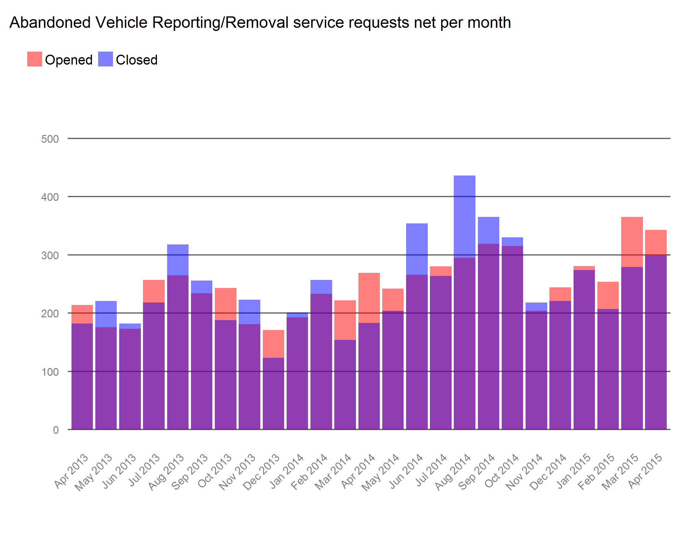
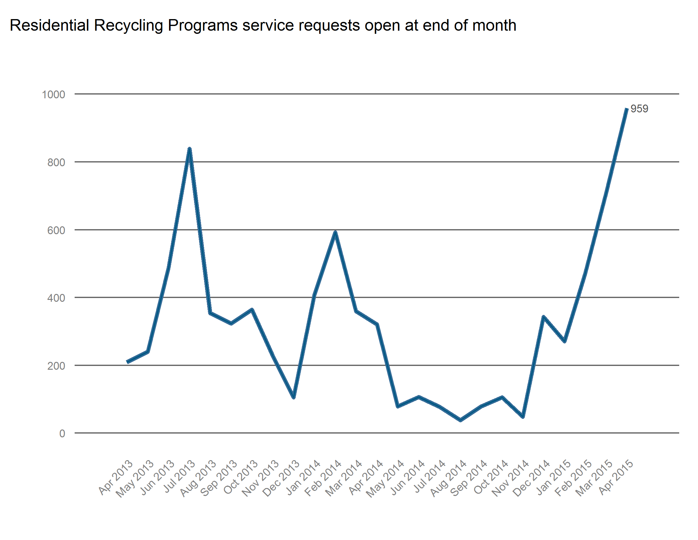
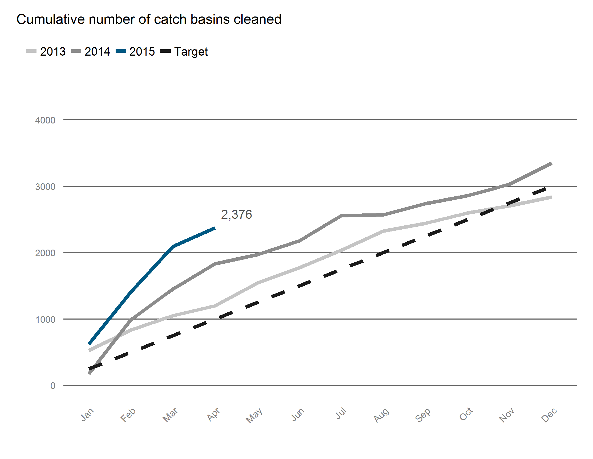

# Quality of Life STAT

## TO DO

 * Better file naming
 * Better documentation

## Usage

Put your data in the `data` folder, run `run.bat` from your command prompt and look for charts in `output`.

Like Customer Service STAT, this script looks for data in the `data` directory, does some transformations, and saves charts in the `output` directory. This STAT program is relatively straightforward. There are two data sources:

 * `311.csv` which is source data on all service requests obtained from 311's performance reporting.
 * `depts.csv` which is a maintained spreadsheet that the analyst must update with data recieved from department heads each month.

## Dependencies

 * lubridate
 * zoo
 * dplyr
 * ggplot2
 * scales
 * reshape2

## Charts

Here are the types of charts this script prodcues

